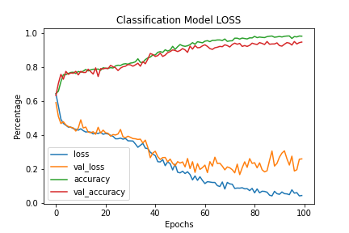
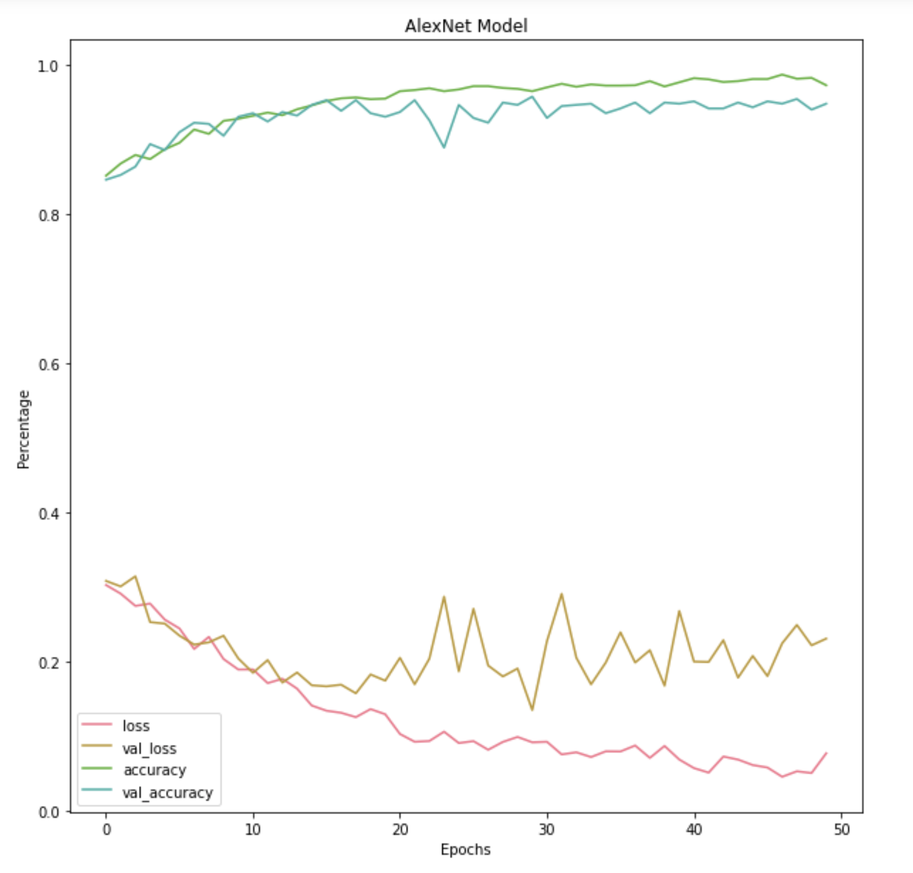
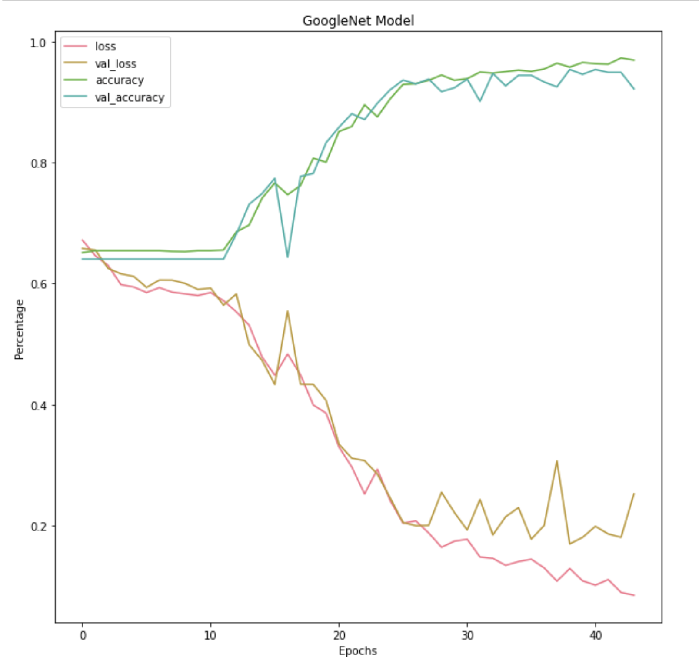
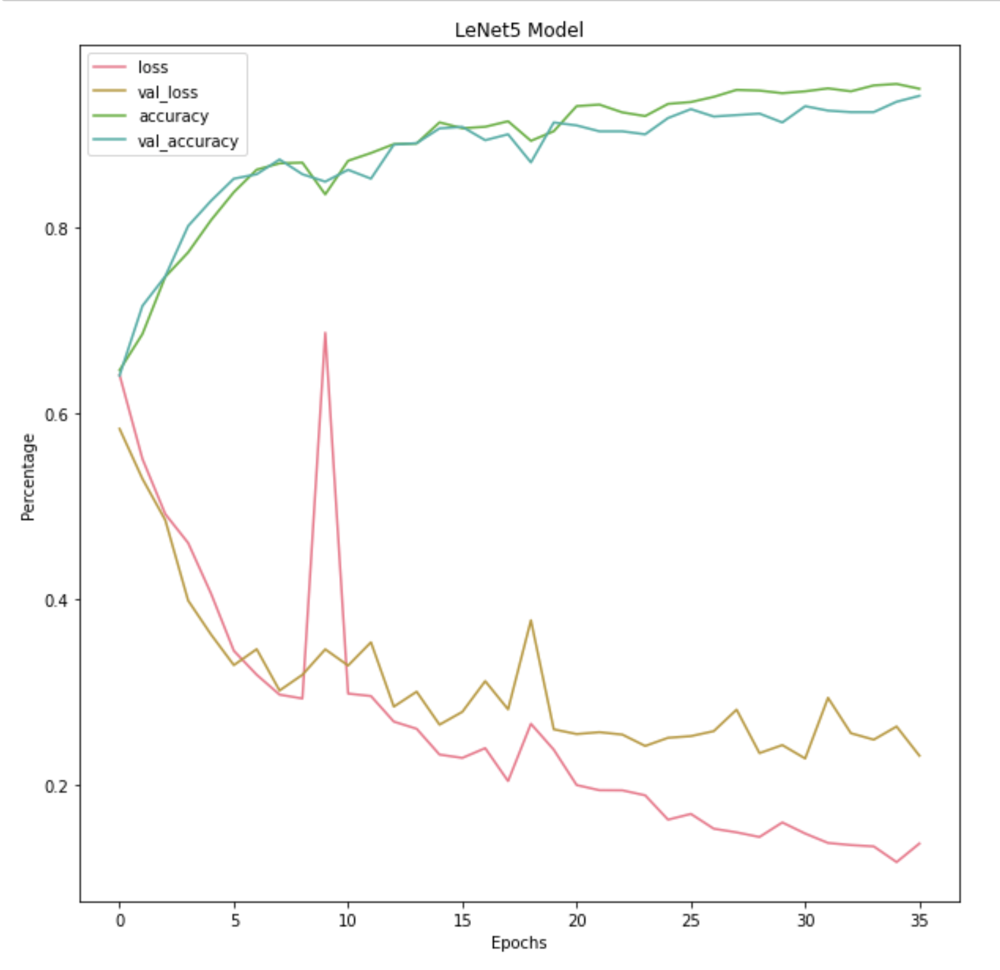

# Neural Network for Neural Tumors

Purpose: Using different neural network models to detect tumors within MRI brain images. 

## Data

Images have been obtained from kaggle: https://www.kaggle.com/shanan93/brain-mri-segmentation-95-5-accuracy

(Put images of brain here?)

## Creating the Models

Three different neural networks were used to train the MRIs. 

### Building a brain
Neural networks are composed of 5 layers (not including the input or output layer). These are:

1. Convolutional Layer: the purpose of this layer is to extract the features from the input data (MRIs). This will give us a feature map in order to get the information about the different layers of the image.

2. Pooling Layer: in order to make the output from the convolutional layer to be easier for computations, the pooling layer is used to reduce the size of the feature map.

3. Fully Connected Layer

4. Dropout: neural networks have a tendency to overfit as it tries to learn more about the input data. This is fixed by adding dropout layers by randomly dropping the neurons used in the connected layer. 

5. Activation Function: 

ImageDataGenerator
EarlyStopping

## Results

Sequential Model = 0.941 (test accuracy), 0.169 (test score)

- Accuracy increased a lot around epoch 25
AlexNet = 0.942 (test accuracy), 0.195 (test score)

- Worked the best in terms of accuracy, but not by much
GoogleNet = 0.907 (test accuracy), 0.251 (test score)

- hardest neural network out of the four to build
LeNet5 = 0.944 (test accuracy), 0.217 (test score)

- each epoch took about 6 minutes to run

