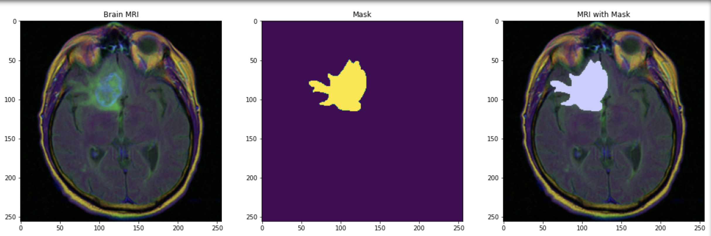
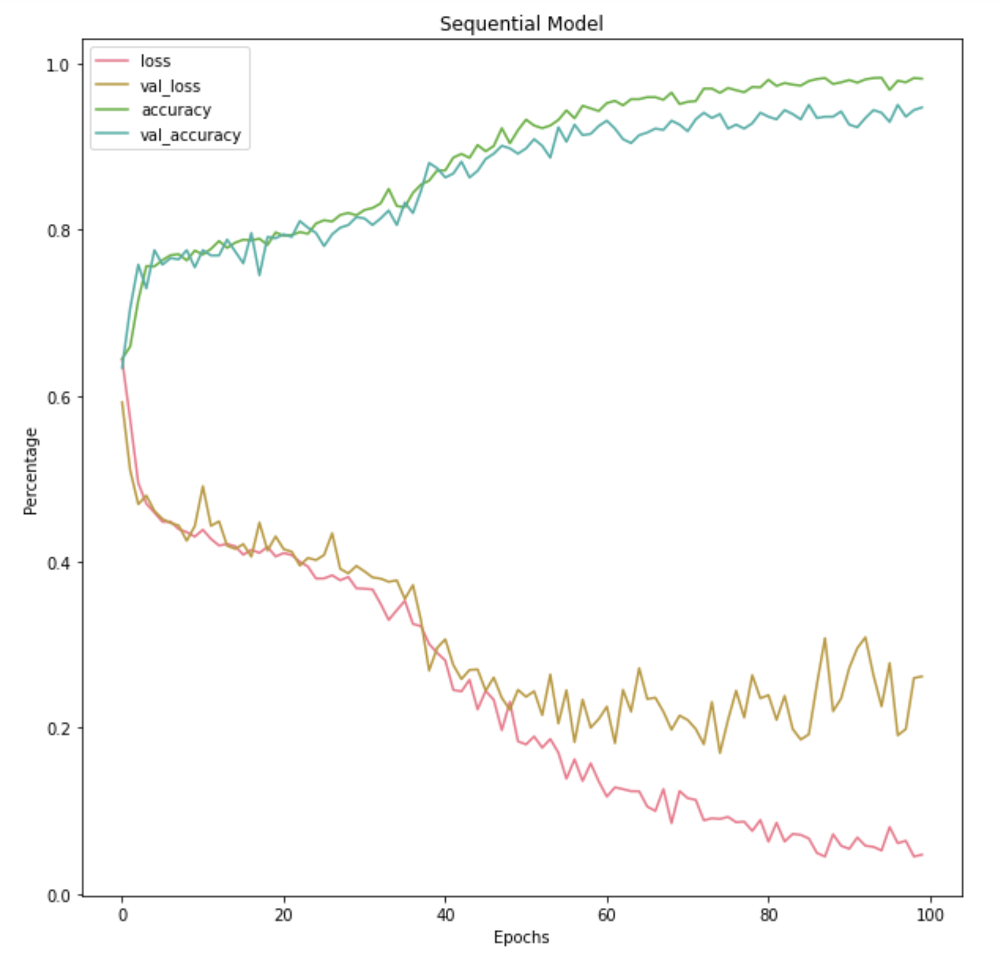

# Neural Network for Neural Tumors

According to the American Brain Tumor Association, approximately 80,000 people get diagnosed with a primary brain tumor, half of which are formed from glial cells. Even worse, for metastatic brain tumors have been diagnosed in about 10-30% of cancer patients. Most of these secondary tumors occur in patients ages 3-12 and 40-70 years old.

The placement of where the tumor grows can have different effects on the patient. These include, but are not limited to: behavioral changes, smell or vision loss, paralysis, and muscle weakness.

## Data

Images have been obtained from this kaggle dataset: https://www.kaggle.com/shanan93/brain-mri-segmentation-95-5-accuracy

The images that we're going to be using for the models will be of mri slices. MRIs are created by using magnetic and radio frequencies of light in order to get different slices of the brain. 

To make the tumor stand out compared to that of the rest of the soft tissue of the brain, the patient has contrast dye injected into their blood. The tumor indicated in this image would be malignant due to the abnormal shape shown through the mask image. 

Compared to malignant tumors, benign tumors are not grow and invade surrounding tissues. However, they are still harmful to the patient because it can compress surrounding brain tissue and cause many problems consisting of, but limited to, vision, hearing, and balance dificulties. 

## Building a brain
Neural networks are composed of 5 layers (not including the input or output layer). These are:

1. Convolutional Layer: the purpose of this layer is to extract the features from the input data (MRIs). This will give us a feature map in order to get the information about the different layers of the image.

2. Pooling Layer: in order to make the output from the convolutional layer to be easier for computations, the pooling layer is used to reduce the size of the feature map.

3. Fully Connected Layer: used to classify the image into a label

4. Dropout: neural networks have a tendency to overfit as it tries to learn more about the input data. This is fixed by adding dropout layers by randomly dropping the neurons used in the connected layer. 

5. Activation Function: Defines the output of the model. The outcome can change according to the activation function that is chosen. 

## Results

### Basic Sequential Model
Uses the basic architecture of a CNN to which we can build off of to the create more elaborate and extensive models mentioned later.

Sequential Model = 0.941 (test accuracy), 0.169 (test score)

- Accuracy increased a lot around epoch 25

### LeNet 5 Model

The architecture for this model is simple and well known. It's typically used for handwritten digit recognition from the MNIST dataset. This Model is a shallower and smaller version of the AlexNet model.

LeNet 5 = 0.944 (test accuracy), 0.217 (test score)

- each epoch took about 6 minutes to run

### AlexNet Model

This model had won the 2012 ImageNet ILSVRC challenge and from our results, we can see why. From the four models that are used in this study, AlexNet has the highest test accuracy, but it's test score is greater than that of the basic sequential model used previously. This model was one of the first that had stacked convolutional layers ontop of one another compared to having a pooling layer in between.

AlexNet = 0.942 (test accuracy), 0.195 (test score)

- Worked the best in terms of accuracy, but not by much with respect to the basic sequential model

### GoogleNet Model
This model had won the ILSVRC 2014 and was much deeper to that of the AlexNet architecture due to the subnetworks of inception layers. There were less parameters from this model relative to that of AlexNet.

GoogleNet = 0.907 (test accuracy), 0.251 (test score)

- hardest neural network out of the four to build

Due to these images being slices of the brain. Some images of the brain will have smaller amounts of the tumor relative to other images. 

## Conclusions
The deeper the neural network is doesn't mean it will work better than shallower networks. Also, the simpler the model, doesn't meant that the epoch run time will be faster. It all depends on which layers are chosen and how the model is built. 